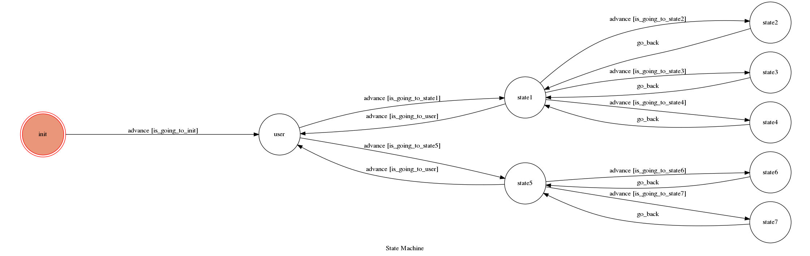

# YOUTUBE Chatbot
A yotube chatbot based in a finite state machine.

## Setup

### Prerequisite
* Python 3.6
* Pipenv
* Facebook Page and App
* HTTPS Server

#### Install Dependency
```sh
pip3 install pipenv

pipenv --three

pipenv install

pipenv shell
```

* pygraphviz (For visualizing Finite State Machine)
    * [Setup pygraphviz on Ubuntu](http://www.jianshu.com/p/a3da7ecc5303)
	* [Note: macOS Install error](https://github.com/pygraphviz/pygraphviz/issues/100)

#### Run the sever

```sh
python3 app.py
```

## Finite State Machine


## Usage
The initial state is set to `init`.

Every time `user` state is triggered to `advance` to another state, it will `go_back` to `user` state after the bot replies corresponding message.
* state: init
	* Input: "wake"
		* state: user
		* Reply: YOUTUBE buttons(musics or trending videos) 
			* Input: "music"
				* state: state1
				* Reply: 三個選擇介面(study, funk or guitar music)
					* Input: "study"
						* state: state2(study)
						* Reply: 有關study music的YOUTUBE連結(爬蟲後的前五個影片中隨機選一個)
					* Input: "funk"
						* state: state3(funk)
						* Reply: 有關funk music的YOUTUBE連結(爬蟲後的前五個影片中隨機選一個)		
					* Input: "guitar"
						* state: state4(guitar)
						* Reply: 有關guitar music的YOUTUBE連結(爬蟲後的前五個影片中隨機選一個)		
			* Input: "video"
				* state: state5
				* Reply: 兩個選擇介面(news or movie)
					* Input: "news"
						* state: state6(news)
						* Reply: 熱門新聞的前五個YOUTUBE連結
					* Input: "movie"
						* state: state7(movie)
						* Reply: 熱門電影的前五個YOUTUBE連結


	refference: https://hackmd.io/@ccw/B1Xw7E8kN?type=view#Q2-如何在-Heroku-使用-pygraphviz

## Reference
[Pipenv](https://medium.com/@chihsuan/pipenv-更簡單-更快速的-python-套件管理工具-135a47e504f4) ❤️ [@chihsuan](https://github.com/chihsuan)

[TOC-Project-2019](https://github.com/winonecheng/TOC-Project-2019) ❤️ [@winonecheng](https://github.com/winonecheng)

Flask Architecture ❤️ [@Sirius207](https://github.com/Sirius207)

[Line line-bot-sdk-python](https://github.com/line/line-bot-sdk-python/tree/master/examples/flask-echo)
